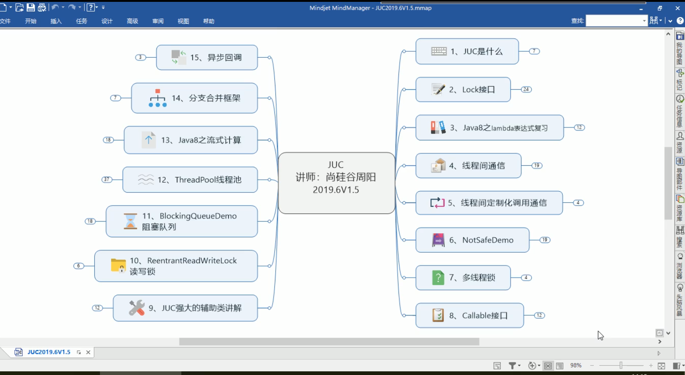
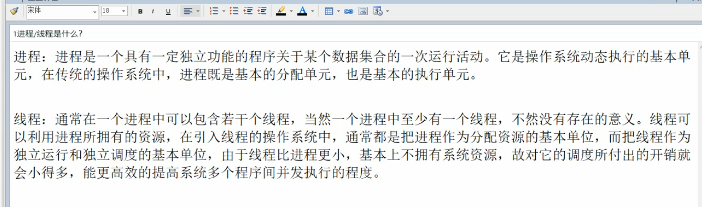
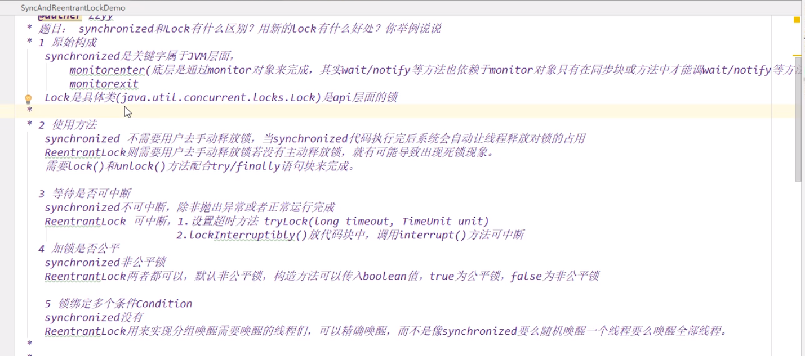

https://www.bilibili.com/video/BV1vE411D7KE?p=38

线程 进程 协程

https://www.baidu.com/s?ie=UTF-8&wd=%E8%BF%9B%E7%A8%8B%20%E7%BA%BF%E7%A8%8B%20%E5%8D%8F%E7%A8%8B

并发 并行

你吃饭吃到一半，电话来了，你一直到吃完了以后才去接，这就说明你不支持并发也不支持并行。 你吃饭 吃到一半，电话来了，你停了下来接了电话，接完后继续吃饭，这说明你支持并发。 你吃饭吃到一半，电话来了，你一边打电话一边吃饭，这说明你支持并行。

并发的关键是你有处理多个任务的能力，不一定要同时。 并行的关键是你有同时处理多个任务的能力。

所以我认为它们最关键的点就是：是否是『同时』。

虚假唤醒！！！！

当一个条件满足时，很多线程都被唤醒了，但是只有其中部分是有用的唤醒，其它的唤醒都是无用功 1.比如说买货，如果商品本来没有货物，突然进了一件商品，这是所有的线程都被唤醒了 ，但是只能一个人买，所以其他人都是假唤醒，获取不到对象的锁

中断和虚假唤醒是可能产生的，所以要用loop循环，if只判断一次，while是只要唤醒就要拉回来再判断一次。if换成while

在if块中使用wait方法，是非常危险的，因为一旦线程被唤醒，并得到锁，就不会再判断if条件，而执行if语句块外的代码，所以建议，凡是先要做条件判断，再wait的地方，都使用while循环来做

