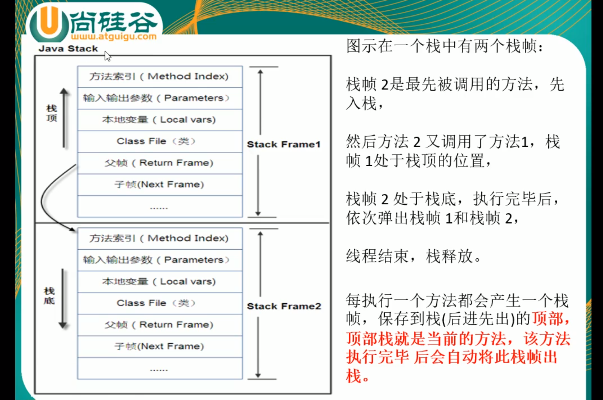
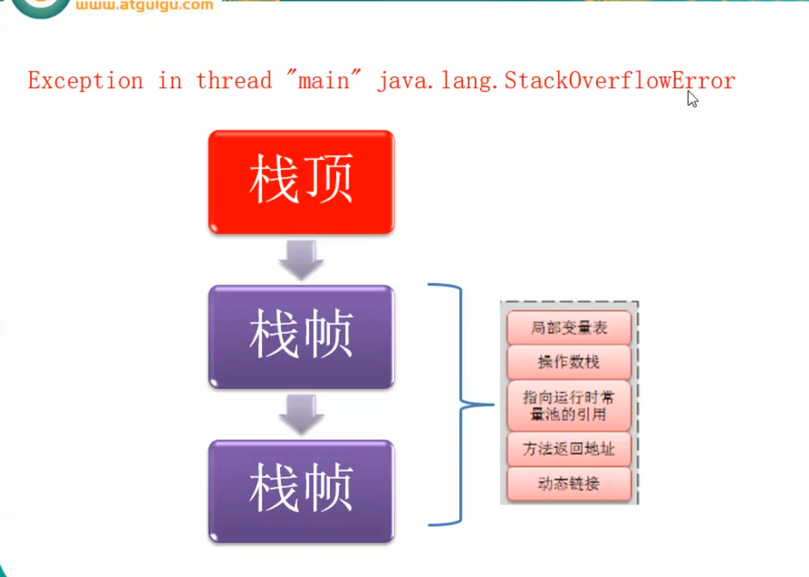
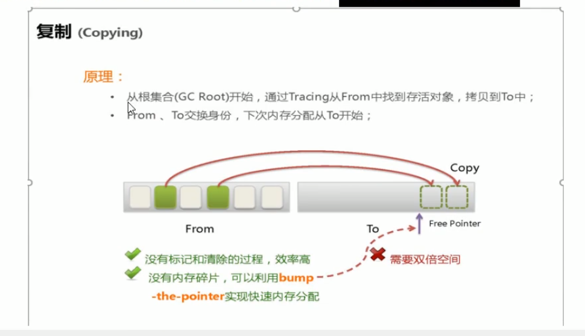
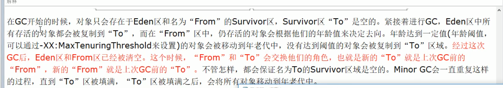

# 2020权威_juc 与 jvm _并发编程_ Java 必学_阳哥- 尚硅谷

https://www.bilibili.com/video/BV1vE411D7KE?p=13

1.JVM的位置

类加载器：

classload

双亲委派机制

线程start2次异常

博客解释：https://www.cnblogs.com/JQKA/p/11772667.html

https://segmentfault.com/a/1190000017255007

Native

寄存器

-Xms1024m -Xmx1024m -XX:+PrintGCDetails

[GC (Allocation Failure)

[PSYoungGen: 2023K->495K(2560K)]  2023K->774K(9728K), 0.0006157 secs]

[Times: user=0.00 sys=0.00, real=0.00 secs]

[Full GC (Allocation Failure)

[PSYoungGen: 0K->0K(2048K)]

[ParOldGen: 4097K->4066K(7168K)] 4097K->4066K(9216K),

[Metaspace: 3242K->3242K(1056768K)], 0.0038735 secs]

[Times: user=0.00 sys=0.00, real=0.00 secs] 

复制算法

标记清除：

标记压缩

总结：

G1和CMS博客：https://yuanrengu.com/2020/4c889127.html

JMM:

