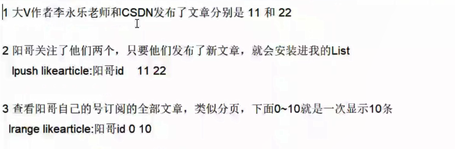

8大基本数据类型：

    1.String(字符类型)
    2.Hash(散列类型)
    3.List(列表类型)
    4.Set(集合类型)
    5.SortedSet(有序集合类型，简称zset)
    6.Bitmap(位图)
    7.HyperLogLog(统计)
    8.GEO（地理）

应用场景：

    1.String(字符类型)
        a.商品编号、订单号采用INCR命令生成
        b.是否喜欢的文章
    2.Hash(散列类型)
        购物车早期，当前小中厂可用

    3.List(列表类型)
        微信文章订阅公众号

    4.Set(集合类型)
        用户ID，立即参与按钮	                sadd key 用户ID
        显示已经有多少人参与了，上图23208人参加	SCARD key
        抽奖(从set中任意选取N个中奖人)	SRANDMEMBER key 2     随机抽奖2个人，元素不删除
                                        SPOP key3             随机抽奖3个人，元素会删除

    5.SortedSet(有序集合类型，简称zset)
    6.Bitmap(位图)
    7.HyperLogLog(统计)
    8.GEO（地理）

定期删除：

    Redis不可能时时刻刻遍历所有被设置了生存时间的key，来检测数据是否已经到达过期时间，然后对它进行删除。
    立即删除能保证内存中数据的最大新鲜度，因为它保证过期键值会在过期后马上被删除，其所占用的内存也会随之释放。
    但是立即删除对cpu是最不友好的。因为删除操作会占用cpu的时间，如果刚好碰上了cpu很忙的时候，比如正在做交集或排序等计算的时候，就会给cpu造成额外的压力，让CPU心累，时时需要删除，忙死。。。。。。
    这会产生大量的性能消耗，同时也会影响数据的读取操作。

惰性删除：

    数据到达过期时间，不做处理。等下次访问该数据时，
    如果未过期，返回数据；
    发现已过期，删除，返回不存在。
    惰性删除策略的缺点是，它对内存是最不友好的。
    如果一个键已经过期，而这个键又仍然保留在数据库中，那么只要这个过期键不被删除，它所占用的内存就不会释放。
    在使用惰性删除策略时，如果数据库中有非常多的过期键，而这些过期键又恰好没有被访问到的话，那么它们也许永远也不会被删除(除非用户手动执行FLUSHDB)，
    我们甚至可以将这种情况看作是一种内存泄漏–无用的垃圾数据占用了大量的内存，而服务器却不会自己去释放它们，这对于运行状态非常依赖于内存的Redis服务器来说,肯定不是一个好消息

定时删除：

    定期删除策略是前两种策略的折中:
    定期删除策略每隔一段时间执行一次删除过期键操作，并通过限制删除操作执行的时长和频率来减少删除操作对CPU时间的影响。
    周期性轮询redis库中的时效性数据，采用随机抽取的策略，利用过期数据占比的方式控制删除频度
    特点1：CPU性能占用设置有峰值，检测频度可自定义设置
    特点2：内存压力不是很大，长期占用内存的冷数据会被持续清理
    总结:周期性抽查存储空间（随机抽查，重点抽查)

    举例：redis默认每个100ms检查，是否有过期的key，有过期key则删除。注意：redis不是每隔100ms将所有的key检查一次而是随机抽取进行检查(如果每隔100ms,全部key进行检查，redis直接进去ICU)。

    因此，如果只采用定期删除策略，会导致很多key到时间没有删除。
    定期删除策略的难点是确定删除操作执行的时长和频率：如果删除操作执行得太频繁，或者执行的时间太长，定期删除策略就会退化成定时删除策略，以至于将CPU时间过多地消耗在删除过期键上面。
    如果删除操作执行得太少，或者执行的时间太短，定期删除策略又会和惰性删除束略一样，出现浪费内存的情况。因此，如果采用定期删除策略的话，服务器必须根据情况，合理地设置删除操作的执行时长和执行频率。

8大淘汰策略：

    设置：  config set maxmemory-policy allkeys-lru

    noeviction: 不会驱逐任何key （默认使用）
    allkeys-lru: 对所有key使用LRU算法进行删除
    volatile-lru: 对所有设置了过期时间的key使用LRU算法进行删除
    allkeys-random: 对所有key随机删除
    volatile-random: 对所有设置了过期时间的key随机删除
    volatile-ttl: 删除马上要过期的key
    allkeys-lfu: 对所有key使用LFU算法进行删除
    volatile-lfu: 对所有设置了过期时间的key使用LFU算法进行删除

LRU:

    LRU是Least Recently Used的缩写，即最近最少使用，是一种常用的页面置换算法，
    选择最近最久未使用的数据予以淘汰。

LFU:

    最近最不常用页面置换算法(Least Frequently Used),也就是淘汰一定时期内被访问次数最少的页!

区别：

    LRU关键是看页面最后一次被使用到发生调度的时间长短！
    LFU关键是看一定时间段内页面被使用的频率!
